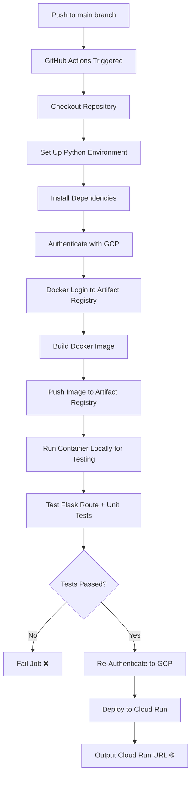

# 🚀 Build & Deploy to Cloud Run – Your First CI/CD Pipeline

Welcome! This repo shows you how to set up a simple yet powerful **CI/CD pipeline** using **GitHub Actions**.  
Every time you push to the `main` branch, your **Python Flask API** app is automatically built, tested, and deployed to **Google Cloud Run**. 🎉

---

## 🛠️ What This Pipeline Does

- ✅ Listens for pushes to the `main` branch
- 🐳 Builds a Docker image of your Flask API app
- 🧪 Runs API tests using `unittest` to verify routes
- 🚀 Deploys to **Google Cloud Run** if tests pass
- 🔒 Uses **GitHub Secrets** to keep credentials secure

---

## 📋 Prerequisites

Before you begin, ensure you have the following:

- ✅ A **Google Cloud Project** with **Cloud Run** enabled
- 🗂️ An **Artifact Registry** (Docker format)
- 👤 A **GCP service account** with:
  - Cloud Run Admin
  - Artifact Registry Writer
  - IAM Token Creator permissions
- 🔐 These GitHub **Secrets** configured in your repository:
  - `GCP_PROJECT_ID` – your GCP project ID
  - `GCP_REGION` – e.g. `us-central1`
  - `GCP_SERVICE` – your Cloud Run service name
  - `GCP_REGISTRY` – registry region, e.g. `us-central1`
  - `GCP_CREDENTIALS_JSON` – service account key in JSON format
  - `GCP_CI_CD_ROUTE` – Flask API route to test (e.g. `/ci-cd`)

---

## 🔄 Pipeline Workflow (Step-by-Step)

1. ✅ **Checkout code** from GitHub
2. 🐍 **Set up Python** using `actions/setup-python`
3. 📦 **Install dependencies** via `pip install -r requirements.txt`
4. 🔐 **Authenticate with GCP** using the service account key
5. 🔑 **Docker login** to Artifact Registry
6. 🛠️ **Build & Push Docker Image** tagged with commit SHA
7. 🧪 **Run Unit Tests** via Docker (`unittest` + route test via `curl`)
8. 🚀 **Deploy to Cloud Run** (only if tests pass)
9. 🌐 **Output your Cloud Run URL** so you can visit your deployed API

---

### 🎨 Visual Workflow Diagram (Mermaid Syntax)





## 📄 GitHub Actions Workflow

Here's the actual workflow file at `.github/workflows/ci-cd.yaml`:

```yaml

name: 'Build and Deploy to Cloud Run'

on:
  push:
    branches:
      - main

env:
  PROJECT_ID: ${{ secrets.GCP_PROJECT_ID }}
  REGION: ${{ secrets.GCP_REGION }}
  SERVICE: ${{ secrets.GCP_SERVICE }}
  REGION_REGISTORY: ${{ secrets.GCP_REGISTRY }}
  CLOUD_RUN_SERVICE_ACCOUNT: ${{ secrets.CLOUD_RUN_SERVICE_ACCOUNT }}
  REGISTRY: ${{ secrets.REGISTRY_NAME }}

jobs:
  deploy:
    runs-on: 'ubuntu-latest'

    permissions:
      contents: 'read'
      id-token: 'write'

    strategy:
      matrix:
        python-version: [3.9]

    steps:
      - name: 'Checkout'
        uses: 'actions/checkout@v4'

      - name: 'Set up Python'
        uses: 'actions/setup-python@v2'
        with:
          python-version: ${{ matrix.python-version }}

      - name: 'Install Python dependencies'
        run: |
          pip install -r requirements.txt

      - id: 'auth'
        name: 'Authenticate to Google Cloud'
        uses: 'google-github-actions/auth@v2'
        with:
          credentials_json: '${{ secrets.GCP_CREDENTIALS_JSON }}'

      - name: 'Docker Auth'
        uses: 'docker/login-action@v3'
        with:
          username: '_json_key'
          password: '${{ secrets.GCP_CREDENTIALS_JSON }}'
          registry: '${{ env.REGION_REGISTORY }}-docker.pkg.dev'

      - name: 'Build and Push Container'
        run: |-
          gcloud auth configure-docker '${{ env.REGION_REGISTORY }}-docker.pkg.dev'
          DOCKER_TAG="${{ env.REGION_REGISTORY }}-docker.pkg.dev/${{ env.PROJECT_ID }}/${{env.REGISTRY}}/test:${{ github.sha }}"
          docker build --tag "${DOCKER_TAG}" .
          docker push "${DOCKER_TAG}"

      - name: 'Test Container'
        run: |-
          DOCKER_TAG="${{ env.REGION_REGISTORY }}-docker.pkg.dev/${{ env.PROJECT_ID }}/${{env.REGISTRY}}/test:${{ github.sha }}"
          
          CONTAINER_ID=$(docker run -d -p 5000:5000 "$DOCKER_TAG")
          sleep 10
          python -m unittest test.py
          
          TEST_STATUS=$?
          docker stop "$CONTAINER_ID"
          docker rm "$CONTAINER_ID"
          exit $TEST_STATUS

      - name: Authenticate to Google Cloud
        uses: google-github-actions/auth@v2
        with:
          credentials_json: '${{ secrets.GCP_CREDENTIALS_JSON }}'
          token_format: 'access_token'

      - name: 'Deploy to Cloud Run'
        uses: 'google-github-actions/deploy-cloudrun@v2'
        with:
          service: '${{ env.SERVICE }}'
          region: '${{ env.REGION }}'
          image: '${{ env.REGION_REGISTORY }}-docker.pkg.dev/${{ env.PROJECT_ID }}/${{ env.REGISTRY }}/test:${{ github.sha }}'

      - name: 'Show output'
        run: echo ${{ steps.deploy.outputs.url }}
```

